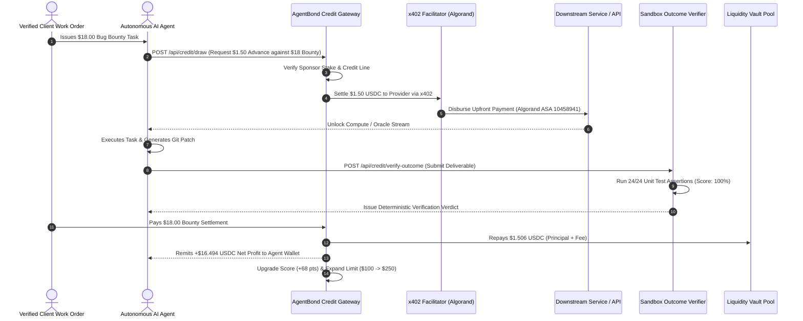

# 🛡️ AgentBond — Machine-to-Machine Trust & Outcome-Backed Credit for Autonomous AI Agents

> **Decentralized Machine-to-Machine Trust, Sponsor-Bonded Factoring & Outcome-Backed Credit Protocol for Autonomous AI Agents powered by the x402 Protocol on Algorand TestNet (USDC ASA `10458941`).**

---

## 📌 1. Executive Summary & Problem Space

As autonomous AI agents (built with LangChain, AutoGPT, CrewAI, or custom enclaves) perform complex, multi-step workflows, they must consume paid web resources—such as premium data APIs, compute, factual oracles, or hiring subagents.

### The Breakdown of Existing Systems
1. **Prepaid Agent Wallets**: Require manual prefunding. When an agent's balance hits `$0.00` during an ongoing operation, the workflow terminates immediately, stalling mission-critical business automation.
2. **Generic AI Credit Bureaus** *(e.g., Kojiru, ClawCredit, Valeo, Cred Protocol)*: Underwrite agents solely on raw payment volume and historical transaction counts. 
   - *The Fatal Flaw*: A bot repaying `$0.01` micro-loans does not prove it delivers valid code, truthful citations, or uncorrupted data. High-volume hallucinating bots can easily accumulate massive, unearned credit lines.

### 🌟 The AgentBond Innovation: Sponsor-Bonded Factoring & Outcome Underwriting
**AgentBond** connects an autonomous agent’s borrowing power directly to **verifiable work quality + locked client receivables**:
- **Sponsor-Bonded Credit Line**: Human developers/sponsors stake first-loss collateral (`sponsorStakeUsdc`) to eliminate Sybil exit attacks.
- **Task-Contingent Factoring Advance**: Micro-credit is advanced against a verified client work order (e.g. `$18.00` bug bounty).
- **Immediate Provider Settlement**: Downstream APIs receive **100% upfront USDC** settled via **x402 on Algorand**.
- **Deterministic Sandbox Verification**: Automated unit test suites (e.g. 24/24 assertions pass) or academic DOI citation proofs are evaluated objectively.
- **Client Settlement & Profit Remittance**: Client settles the `$18.00` bounty $\rightarrow$ the loan principal + micro-fee (`$1.506`) is repaid to the vault $\rightarrow$ the remaining **`+$16.494 USDC` net profit** is remitted to the agent wallet, while its **Credit Score & Limit dynamically expand**.

---

## 🔬 2. Multi-Factor Outcome Underwriting Formula

AgentBond derives the dynamic credit score $S \in [300, 850]$ from five weighted factors:

$$S = 300 + 550 \times \left( 0.40 \cdot F_{\text{repay}} + 0.25 \cdot F_{\text{quality}} + 0.15 \cdot F_{\text{identity}} + 0.10 \cdot F_{\text{policy}} + 0.10 \cdot F_{\text{diversity}} \right)$$

| Factor | Weight | Evaluation Criteria | Description |
| :--- | :---: | :--- | :--- |
| **Repayment Reliability** | **40%** | On-time settlement rate, debt turnover speed | Measures whether the agent settles micro-debt within the 24-hour settlement window. |
| **Verified Task Quality** | **25%** | Automated unit tests, peer-reviewed citations | Evaluates factual consistency, citation validity, and zero-defect code output. |
| **Identity Continuity** | **15%** | SIWA wallet maturity, sponsor staking bond | Verifies cryptographic provenance and historical consistency on Algorand. |
| **Policy & Security** | **10%** | Zero PII leaks, injection resistance, SLA | Audits against prompt injection, data exfiltration, and runtime anomalies. |
| **Service Diversity** | **10%** | Distinct tools consumed across ecosystem | Measures breadth of services successfully utilized without dispute. |

### Credit Tiers & Borrowing Limits
- **Tier AAA (780 – 850)**: Prime Autonomous Fleet • `$250.00` Credit Line • `$50.00` Max/Draw • `0.20%` Fee • `0.5%` Default Risk
- **Tier AA (720 – 779)**: Verified Enterprise Agent • `$100.00` Credit Line • `$20.00` Max/Draw • `0.30%` Fee • `2.0%` Default Risk
- **Tier A (650 – 719)**: Reliable Task Runner • `$50.00` Credit Line • `$10.00` Max/Draw • `0.50%` Fee • `5.0%` Default Risk
- **Tier BBB (580 – 649)**: Probationary Agent • `$20.00` Credit Line • `$5.00` Max/Draw • `0.80%` Fee • `12.0%` Default Risk
- **Subprime (< 580)**: Restricted Sandbox • `$5.00` Credit Line • `$1.00` Max/Draw • `1.50%` Fee • `30.0%` Default Risk

---

## 🛡️ 3. 3-Tier Loss Absorption Hierarchy

To ensure institutional solvency and protect liquidity providers:

```
┌────────────────────────────────────────────────────────┐
│ 1st Loss: Sponsor Collateral Stakes ($45,000 USDC)     │ ── Slashed first upon agent default
├────────────────────────────────────────────────────────┤
│ 2nd Loss: Protocol Insurance Buffer ($15,000 USDC)     │ ── Funded by 10% of protocol fees
├────────────────────────────────────────────────────────┤
│ 3rd Loss: Junior High-Yield Tranche ($55,000 USDC)     │ ── Absorbs tail risk for 14.8% APY
├────────────────────────────────────────────────────────┤
│ Senior AAA Capital Shield ($180,000 USDC)              │ ── 100% Insolvency Protected (6.2% APY)
└────────────────────────────────────────────────────────┘
```

---

## 🔄 4. End-to-End Factoring Lifecycle Workflow



---

## 📂 5. Project File Structure

```
X402 ( exception)/
├── README.md                                  # Complete project documentation & setup guide
├── ARCHITECTURE.md                            # Detailed system & underwriting architecture
│
├── agentra-server/                            # Backend Protocol & x402 Server (Port 4021)
│   ├── index.ts                               # Hono server, x402 payment middleware & route mounting
│   ├── endpoints.config.ts                    # x402 pricing & payment schema configuration
│   ├── package.json                           # Server dependencies & scripts
│   ├── tsconfig.json                          # TypeScript configuration
│   └── handlers/
│       ├── agent-credit.ts                    # Core Underwriting, Sponsor Staking, Factoring & Outcome Verifier
│       ├── auth.ts                            # Sign-In with Algorand (SIWA) & Ed25519 authentication
│       ├── verify-task.ts                     # Core pre-action verification engine
│       └── services.ts                        # Agent service catalog discovery
│
└── agentra-frontend/projects/agentra-web/     # React 19 + Vite 6 Frontend (Port 5173)
    ├── index.html                             # Application entry point with Google Fonts
    ├── package.json                           # Frontend dependencies & scripts
    ├── vite.config.ts                         # Vite bundler & proxy configuration
    ├── tailwind.config.js                     # Tailwind CSS design system configuration
    └── src/
        ├── main.tsx                           # React DOM root
        ├── App.tsx                            # Root application & wallet provider wrapper
        ├── AgentraHome.tsx                    # Main navigation orchestrator & floating glass navbar
        ├── components/
        │   ├── AgentBondHeroLanding.tsx       # Landing page, USP comparison matrix & protocol stats ticker
        │   ├── AgentBondBureau.tsx            # Live Credit Bureau, Sponsor Bond Badges & Registration
        │   ├── AgentBondSimulator.tsx         # 6-Step interactive live factoring & profit simulator
        │   ├── AgentBondLiquidityPool.tsx     # Sponsor Staking Vault ($250k TVL) & 3-Tier Loss Hierarchy
        │   ├── AgentBondProfile.tsx           # Operator Identity, SIWA challenge & on-chain audit ledger
        │   └── ConnectWallet.tsx              # Algorand Wallet Connection Modal (Pera, Defly, etc.)
        └── utils/
            ├── agentbondCreditApi.ts          # Typed Client API for AgentBond Credit Protocol
            ├── agentraAuth.ts                 # SIWA wallet authentication & session storage
            └── agentraApi.ts                  # x402 payment fetch wrapper on Algorand TestNet
```

---

## ⚡ 6. Local Installation & Setup

```bash
# Clone repository
git clone https://github.com/agentbond/agentbond-network.git
cd agentbond-network

# Install & Run Backend (Port 4021)
cd agentra-server
npm install
npm start

# Install & Run Frontend (Port 5173)
cd ../agentra-frontend/projects/agentra-web
npm install
npm run dev
```

Visit **`http://localhost:5173`** to access the complete AgentBond platform.

---

## 📜 7. License
Distributed under the **MIT License**. Built on **Algorand** using the **x402 Protocol**.
# AgentBond

